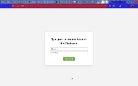

<b>Requirements</b>
This is a springboot websocket maven project
- Must have springboot  version 3.2.4
- Look at the <b>pom.xml</b> for dependencies
- mysql  Ver 8.0.25

<b>Configuration</b>
Look at <b>chatroom/src/main/resources/application.properties</b>
- Add the link to the table via <b>spring.datasource.url</b>
- Add username and passowrd for mysql via <b>spring.datasource.username and spring.datasource.password</b>
- Add the port to be used by the application via <b>server.port=</b>

<b>Running the application</b>
If you have an IDE of vscode you navigate to <b>/chatroom/ChatroomApplication.java</b> and "press" run
Or you can use this command = mvn spring-boot:run
But you need to have maven installed

<b>Unit testing</b>
If you have an IDE of vscode you navigate to <b>/chatroom/db/*.java</b> and "press" run
Or you can use maven
    - <b>NB!!! I added unit test for the db layer only because I cover all bases here and the service layer methods simply call the db methods</b>

<b>Testing on Postman</b>
I decided not use postman for testing, because I'm using springboot websockets.And for springboot websockets you need to subscribe to a channel in order to send messages to other users. And according to the reply from Postman Team in their blog: https://blog.postman.com/postman-supports-websocket-apis/ . Postman does not support subscribe to a topic at present.

So therefore I created a simple Front end (using javascript,css and html) for testing.
- To use the is application enter this in your broswer  =  localhost:<port number>
- You will presented with a login page
    - Your can use the following username and passowrd
        - username = tom and password = 1234
        - username = john and password = 5341
        - username = xan and password = qwerty
    - Then you you can chat
    - For special commands = viewing the history and deleting:
        - Type in <b>/history</b> ,  for viewing the history of the chatroom
        - Type in <b>/delete <message id> </b> for deleting a message. Note you can only delete a message you entered

<b>See chatroom.gif for a demo</b>

<b>Future plans</b>
- Use docker for running the application
- Or using a cloud service like AWS , for Server scalability and CI/CD